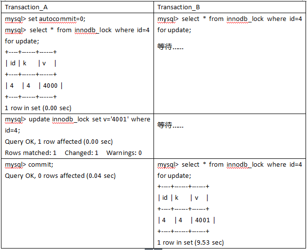
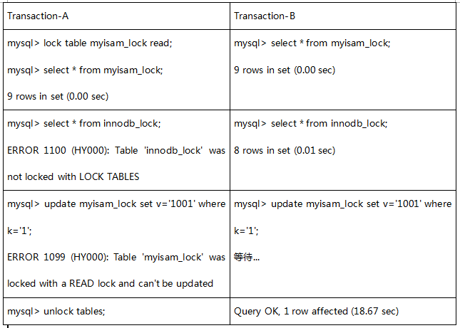
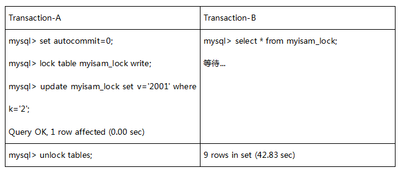

# 一、数据库引擎

|                  | InnoDB |      MyISAM      |
| :--------------: | :----: | :--------------: |
|     事物支持     |   是   |        否        |
|     外键支持     |   是   |        否        |
|        锁        |  行级  |       表级       |
|     全文索引     |   否   | 是【只支持英文】 |
| 崩溃安全恢复支持 |   是   |        否        |

选择：**MyISAM相对简单，所以在效率上要优于InnoDB。如果系统插入和查询操作多，不需要事务和外键，选择MyISAM，如果需要频繁的更新、删除操作，或者需要事务、外键、行级锁的时候，选择InnoDB。**

# 二、事务

## 1、事务特性

1. 原子性（Atomicity）：事务作为一个整体被执行 ，要么全部执行，要么全部不执行。事务执行过程中出错，会回滚到事务开始前的状态，所有的操作就像没有发生一样。
2. 一致性（Consistency）：事务开始前和结束后，数据库的完整性约束没有被破坏，执行结果符合预期规则 。比如A向B转账，不可能A扣了钱，B却没收到。
3. 隔离性（Isolation）：同一时间，只允许一个事务请求同一数据，不同的事务之间彼此没有任何干扰。比如A正在从一张银行卡中取钱，在A取钱的过程结束前，B不能向这张卡转账。
4. 持久性（Durability）：一个事务一旦提交，对数据库的修改应该永久保存，不能回滚。

## 2、事物的并发问题

1. 脏读：事务A读取了事务B已经修改但尚未提交的数据。若事务B回滚数据，事务A的数据存在不一致性的问题，那么A读取到的数据就是脏数据。【一致性】
2. 不可重复读：事务A在执行过程中，第一次读取到的是原始数据，第二次读取到的是事务B已经提交的修改后的数据。导致两次读取同一数据的值不一致。不符合事务的隔离性。【隔离性】
3. 幻读：事务A根据相同条件第二次查询到事务B提交的新增或删除的数据，两次数据结果集不一致。不符合事务的隔离性。【隔离性】

　　小结：不可重复读的和幻读很容易混淆，**不可重复读侧重于修改，幻读侧重于新增或删除。解决不可重复读的问题只需锁住满足条件的行，解决幻读需要锁表。**

## 3、事物的隔离级别

| 事务隔离级别                 |   读数据一致性   | 脏读 | 不可重复读 | 幻读 |
| ---------------------------- | :--------------: | ---- | ---------- | ---- |
| 读未提交（read-uncommitted） |     最低级别     | 是   | 是         | 是   |
| 读已提交（read-committed）   |      语句级      | 否   | 是         | 是   |
| 可重复读（repeatable-read）  |      事务级      | 否   | 否         | 是   |
| 串行化（serializable）       | 最高级别，事务级 | 否   | 否         | 否   |

## 4、总结

1. **事务隔离级别为读已提交时，写数据只会锁住相应的行。**
2. **事务隔离级别为可重复读时，若检索条件有索引（包括主键索引），默认加锁方式是next-key 锁【间隙锁】；若检索条件没有索引，则更新数据时会锁住整张表。一个间隙被事务加了锁，其他事务是不能在这个间隙插入记录的，这样可以防止幻读。**
3. **事务隔离级别为串行化时，读写数据都会锁住整张表**
4. **隔离级别越高，越能保证数据的完整性和一致性，但是对并发性能的影响也越大。**
5. **MySQL默认隔离级别是可重复读。**
6. 查看当前数据库的事务隔离级别：**show variables like 'tx_isolation';**
7. [**MYSQL MVCC实现机制**](https://blog.csdn.net/whoamiyang/article/details/51901888)
8. [**next-key 锁【间隙锁】**](https://blog.csdn.net/bigtree_3721/article/details/73731377)

# 三、锁

## 1、[行锁、表锁](https://segmentfault.com/a/1190000012773157)

### ​1、行锁

1. 优势

   - 锁的粒度小；
   - 发生锁冲突的概率低；
   - 处理并发的能力强。

2. 劣势

   - 开销大；
   - 加锁慢；
   - 会出现死锁。

3. 加锁方式

   **自动加锁。**

   对于UPDATE、DELETE和INSERT语句，InnoDB会自动给涉及的数据集加**排他锁**；对于普通SELECT语句，InnoDB不会加任何锁；当然我们也可以显示的加锁：
   	加**共享锁：**select * from tableName where ... **lock in share mode**
   	加**排他锁：**select * from tableName where ... **for update** 

4. **间隙锁【Next-Key锁】**

   ​	当我们用范围条件检索数据，并请求共享或排他锁时，InnoDB会给符合条件的已有数据记录的索引项加锁；对于键值在条件范围内但并不存在的记录，叫做"间隙(GAP)"。InnoDB也会对这个"间隙"加锁，这种锁机制就是所谓的间隙锁(Next-Key锁)。

   危害（坑）：**若执行的条件范围过大，则InnoDB会将整个范围内所有的索引键值全部锁定，很容易对性能造成影响**。

   ```mysql
   Transaction-A
   mysql> update innodb_lock set k=66 where id >=6;
   Query OK, 1 row affected (0.63 sec)
   mysql> commit;
   
   Transaction-B
   mysql> insert into innodb_lock (id,k,v) values(7,'7','7000');
   Query OK, 1 row affected (18.99 sec)
   ```

5. **排他锁**

   **排他锁，也称写锁，独占锁，当前写操作没有完成前，它会阻断其他写锁和读锁。**

   

   ```mysql
   # Transaction_A
   mysql> set autocommit=0;
   mysql> select * from innodb_lock where id=4 for update;
   +----+------+------+
   | id | k    | v    |
   +----+------+------+
   |  4 | 4    | 4000 |
   +----+------+------+
   1 row in set (0.00 sec)
   
   mysql> update innodb_lock set v='4001' where id=4;
   Query OK, 1 row affected (0.00 sec)
   Rows matched: 1  Changed: 1  Warnings: 0
   
   mysql> commit;
   Query OK, 0 rows affected (0.04 sec)
   ```

   ```mysql
   # Transaction_B
   mysql> select * from innodb_lock where id=4 for update;
   +----+------+------+
   | id | k    | v    |
   +----+------+------+
   |  4 | 4    | 4001 |
   +----+------+------+
   1 row in set (9.53 sec)
   ```

6. **共享锁**

   **共享锁，也称读锁，多用于判断数据是否存在，多个读操作可以同时进行而不会互相影响。**如果事务对读锁进行修改操作，很可能会造成死锁。如下图所示。

   

   ```mysql
   # Transaction_A
   mysql> set autocommit=0;
   mysql> select * from innodb_lock where id=4 lock in share mode;
   +----+------+------+
   | id | k    | v    |
   +----+------+------+
   |  4 | 4    | 4001 |
   +----+------+------+
   1 row in set (0.00 sec)
   
   mysql> update innodb_lock set v='4002' where id=4;
   Query OK, 1 row affected (31.29 sec)
   Rows matched: 1  Changed: 1  Warnings: 0
   ```

   ```mysql
   # Transaction_B
   mysql> set autocommit=0;
   mysql> select * from innodb_lock where id=4 lock in share mode;
   +----+------+------+
   | id | k    | v    |
   +----+------+------+
   |  4 | 4    | 4001 |
   +----+------+------+
   1 row in set (0.00 sec)
   
   mysql> update innodb_lock set v='4002' where id=4;
   ERROR 1213 (40001): Deadlock found when trying to get lock; try restarting transaction
   ```

7. **分析行锁定**

   通过检查InnoDB_row_lock 状态变量分析系统上的行锁的争夺情况，命令：

   ​	**show status like 'innodb_row_lock%'**

   ```mysql
   mysql> show status like 'innodb_row_lock%';
   +-------------------------------+-------+
   | Variable_name                 | Value |
   +-------------------------------+-------+
   | Innodb_row_lock_current_waits | 0     |
   | Innodb_row_lock_time          | 0     |
   | Innodb_row_lock_time_avg      | 0     |
   | Innodb_row_lock_time_max      | 0     |
   | Innodb_row_lock_waits         | 0     |
   +-------------------------------+-------+
   ```

   innodb_row_lock_current_waits: 当前正在等待锁定的数量
   innodb_row_lock_time: 从系统启动到现在锁定总时间长度；【非常重要的参数】
   innodb_row_lock_time_avg: 每次等待所花平均时间；【非常重要的参数】
   innodb_row_lock_time_max: 从系统启动到现在等待最长的一次所花的时间；
   innodb_row_lock_waits: 系统启动后到现在总共等待的次数；非常重要的参数，直接决定优化的方向和策略。

8. **行锁优化**

   1. 尽可能让所有数据检索都通过索引来完成，避免无索引行或索引失效导致行锁升级为表锁。
   2.  尽可能避免间隙锁带来的性能下降，减少或使用合理的检索范围。
   3.  尽可能减少事务的粒度，比如控制事务大小，而从减少锁定资源量和时间长度，从而减少锁的竞争等，提供性能。
   4. 尽可能低级别事务隔离，隔离级别越高，并发的处理能力越低。

### 2、表锁

1. 优势

   - 开销小；
   - 加锁快；
   - 无死锁。

2. 劣势

   - 锁粒度大；
   - 发生锁冲突的概率高；
   - 并发处理能力低。

3. 加锁方式

   **自动加锁。**

   查询操作（SELECT），会自动给涉及的所有表加读锁，更新操作（UPDATE、DELETE、INSERT），会自动给涉及的表加写锁。也可以显示加锁：

   ​	共享读锁：**lock table tableName read**;
   ​	独占写锁：**lock table tableName write**;
   ​	批量解锁：**unlock tables**;

4. 共享读锁

   ​	对MyISAM表的读操作（加读锁），不会阻塞其他进程对同一表的读操作，但会阻塞对同一表的写操作。只有当读锁释放后，才能执行其他进程的写操作。

   

   ```mysql
   Transaction-A
   mysql> lock table myisam_lock read;
   Query OK, 0 rows affected (0.00 sec)
   
   mysql> select * from myisam_lock;
   9 rows in set (0.00 sec)
   
   mysql> select * from innodb_lock;
   ERROR 1100 (HY000): Table 'innodb_lock' was not locked with LOCK TABLES
   
   mysql> update myisam_lock set v='1001' where k='1';
   ERROR 1099 (HY000): Table 'myisam_lock' was locked with a READ lock and can't be updated
   
   mysql> unlock tables;
   Query OK, 0 rows affected (0.00 sec)
   ```

   ```mysql
   Transaction-B
   mysql> select * from myisam_lock;
   9 rows in set (0.00 sec)
   
   mysql> select * from innodb_lock;
   8 rows in set (0.01 sec)
   
   mysql> update myisam_lock set v='1001' where k='1';
   Query OK, 1 row affected (18.67 sec)
   ```

5. 独占写锁

   对MyISAM表的写操作（加写锁），会阻塞其他进程对同一表的读和写操作，只有当写锁释放后，才会执行其他进程的读写操作。

   

   ```mysql
   Transaction-A
   mysql> set autocommit=0;
   Query OK, 0 rows affected (0.05 sec)
   
   mysql> lock table myisam_lock write;
   Query OK, 0 rows affected (0.03 sec)
   
   mysql> update myisam_lock set v='2001' where k='2';
   Query OK, 1 row affected (0.00 sec)
   
   mysql> select * from myisam_lock;
   9 rows in set (0.00 sec)
   
   mysql> update innodb_lock set v='1001' where k='1';
   ERROR 1100 (HY000): Table 'innodb_lock' was not locked with LOCK TABLES
   
   mysql> unlock tables;
   Query OK, 0 rows affected (0.00 sec)
   ```

   ```mysql
   Transaction-B
   mysql> select * from myisam_lock;
   9 rows in set (42.83 sec)
   ```

   小结：**表锁，读锁会阻塞写，不会阻塞读。而写锁则会把读、写都阻塞**。

6. 查看加锁情况

   **show open tables;** 1表示加锁，0表示未加锁。

   ```mysql
   mysql> show open tables where in_use > 0;
   +----------+-------------+--------+-------------+
   | Database | Table       | In_use | Name_locked |
   +----------+-------------+--------+-------------+
   | lock     | myisam_lock |      1 |           0 |
   +----------+-------------+--------+-------------+
   ```

7. 分析表锁定

   通过检查table_locks_waited 和 table_locks_immediate 状态变量分析系统上的表锁定，命令：

   ​	**show status like 'table_locks%';**

   ```mysql
   mysql> show status like 'table_locks%';
   +----------------------------+-------+
   | Variable_name              | Value |
   +----------------------------+-------+
   | Table_locks_immediate      | 104   |
   | Table_locks_waited         | 0     |
   +----------------------------+-------+
   ```

   - table_locks_immediate: 表示立即释放表锁数。

   - table_locks_waited: 表示需要等待的表锁数。**此值越高则说明存在着越严重的表级锁争用情况。**

     

   此外，**MyISAM的读写锁调度是写优先**，这也是MyISAM不适合做写为主的存储引擎。因为写锁后，其他线程不能做任何操作，大量的更新会使查询很难得到锁，从而造成永久阻塞。

### 3、什么情况下用表锁？

​	**InnoDB默认采用行锁，在未使用索引字段查询时升级为表锁。**MySQL这样设计并不是给你挖坑。它有自己的设计目的。
​	即便你在条件中使用了索引字段，MySQL会根据自身的执行计划，考虑是否使用索引(所以explain命令中会有possible_key 和 key)。如果MySQL认为全表扫描效率更高，它就不会使用索引，这种情况下InnoDB将使用表锁，而不是行锁。因此，在分析锁冲突时，别忘了检查SQL的执行计划，以确认是否真正使用了索引。

第一种情况：**全表更新**。事务需要更新大部分或全部数据，且表又比较大。若使用行锁，会导致事务执行效率低，从而可能造成其他事务长时间锁等待和更多的锁冲突。

第二种情况：**多表查询**。事务涉及多个表，比较复杂的关联查询，很可能引起死锁，造成大量事务回滚。这种情况若能一次性锁定事务涉及的表，从而可以避免死锁、减少数据库因事务回滚带来的开销。

### 4、总结

1. InnoDB 支持表锁和行锁，使用索引作为检索条件修改数据时采用行锁，否则采用表锁。
2.  InnoDB 自动给写操作加锁，读操作不自动加锁。
3.  行锁可能因为未使用索引而升级为表锁，所以除了检查索引是否创建的同时，也需要通过explain执行计划查询索引是否被实际使用。
4. 行锁相对于表锁来说，优势在于高并发场景下表现更突出，毕竟锁的粒度小。
5.  当表的大部分数据需要被修改，或者是多表复杂关联查询时，建议使用表锁优于行锁。
6.  为了保证数据的一致完整性，任何一个数据库都存在锁定机制。锁定机制的优劣直接影响到一个数据库的并发处理能力和性能。

## 2、[乐观锁、悲观锁](https://www.jianshu.com/p/f5ff017db62a)

# 四、索引

## 1、原理

​	我们拿出一本新华字典，它的目录实际上就是一种索引：非聚集索引。我们可以通过目录迅速定位我们要查的字。而字典的内容部分一般都是按照拼音排序的，这实际上又是一种索引：聚集索引。聚集索引这种实现方式使得按主键的搜索十分高效，但是辅助索引搜索需要检索两遍索引：首先检索辅助索引获得主键，然后用主键到主索引中检索获得记录。

## 2、底层实现【数据结构】

### 1、mysql主要使用[B+树](https://www.jianshu.com/p/3a1377883742)来构建索引，为什么不用二叉树和红黑树？

1. B+树是多叉的，可以减少树的高度。

2. 索引本身较大，不会全部存储在内存中，会以索引文件的形式存储在磁盘上，所以索引在查找数据的过程中会涉及到磁盘I/O操作。

3. 因磁盘I/O效率低下，mysql为了**尽量减少磁盘IO的存取次数**，需要利用了磁盘存取的[局部性原理](https://www.cnblogs.com/xyxxs/p/4440187.html)进行磁盘预读。

   **局部性原理：**为了减少磁盘IO，磁盘往往会进行数据**预读**，会从某位置开始，预先**顺序向后**读取一定长度的数据放入内存。因为磁盘顺序读取的效率较高，不需要寻道时间，因此可以提高IO效率。

   ​	**磁盘预读长度一般为页的整数倍**，主存和磁盘以**页**作为单位交换数据。当需要读取的数据不在内存时，触发**缺页中断**，系统会向磁盘发出读取磁盘数据的请求，磁盘找到数据的起始位置并向后连续读取一页或几页数据载入内存，然后中断返回，系统继续运行。

4. mysql将B+数的一个节点的大小设为一个页，这样每个节点只需要一次I/O就可以完全载入内存【由于节点中有若干个数组，所以地址连续】。

5. 红黑树的结构深度更深，很多逻辑上很近的节点（如父子节点）在物理上可能很远，**无法利用局部性原理**。

在InnoDB里，每个页默认16KB，假设索引的是8B的long型数据，每个key后有个页号4B，还有6B的其他数据（参考《MySQL技术内幕：InnoDB存储引擎》P193的页面数据），那么每个页的扇出系数为16KB/(8B+4B+6B)≈1000，即每个页可以索引1000个key。在高度h=3时，s=1000^3=10亿！！也就是说，InnoDB通过三次索引页的I/O，即可索引10亿的key。**通常来说，索引树的高度在2~4。**

### 2、B+Tree与B-Tree的区别

1. M阶B-Tree

   定义：

   - 树中每个结点至多有m个孩子；
   - 除根结点和叶子结点外，其它每个结点至少有m/2个孩子；
   - 若根结点不是叶子结点，则至少有2个孩子；
   - 所有叶子结点都在同一层；

   特性：

   - 关键字集合分布在整颗树中；
   - 任何一个关键字出现且只出现在一个结点中；
   - 搜索有可能在非叶子结点结束；
   - 其搜索性能等价于在关键字全集内做一次二分查找；
   - 自动层次控制；

2. M阶B+Tree

   定义：

   - 有m个子树的节点包含有m个元素（B-Tree中是m-1）;
   - 非叶子节点不保存数据，只用于索引，所有数据都保存在叶子节点中。
   - 所有分支节点和根节点都同时存在于子节点中，在子节点元素中是最大或者最小的元素。
   - 叶子节点会包含所有的关键字，以及指向数据记录的指针，并且叶子节点本身是根据关键字的大小从小到大顺序链接。

   特性：

   - 所有关键字都出现在叶子结点的链表中（稠密索引），且链表中的关键字是有序的；
   - 不可能在非叶子结点命中，因为非叶子节点只有Key，没有Data；
   - 非叶子结点相当于是叶子结点的索引（稀疏索引），叶子结点相当于是存储所有关键字数据的数据层；
   - 更适合文件索引系统。

### 3、B+Tree与B-Tree的区别

1. B+Tree有n棵子树的结点中含有n个关键字； (而B树是n棵子树有n-1个关键字)。
2. B+Tree所有Key（关键字）存储在叶子节点，非叶子节点不存储真正的data（数据）。
3. B+Tree为所有叶子节点增加了一个链指针，且所有叶子节点的关键字按从小到大顺序链接，增强了区间访问性。

### 4、为什么mysql的索引使用B+树而不是B树呢？

1. B+树更适合外部存储(一般指磁盘存储)，由于内节点(非叶子节点)不存data（数据）只存Key（关键字），所以B+树一个节点可以存储更多的Key，即每个节点能索引的范围更大更精确。也就是说使用B+树单次磁盘I/O的信息量相比较B树更大，I/O效率更高。
2. mysql是关系型数据库，经常会按照区间来访问某个索引列，B+树的叶子节点间按Key的顺序建立了链指针，加强了区间访问性，所以B+树对索引列上的区间范围查询很友好。而B树每个节点的key和data在一起，无法进行区间查找。

## 3、索引优点

1. 快速读取数据。
2. 唯一性索引能保证数据记录的唯一性。
3. 实现表与表之间的参照完整性【通过主键索引】。

## 4、索引缺点

1. 索引需要占用物理空间。
2. 当对表中的数据进行增加、删除和修改的时候，索引也要动态的维护，降低了数据的维护速度。

# 五、mysql性能分析

## 1、MySQL 自身瓶颈

​	MySQL自身常见的性能问题有**磁盘空间不足，磁盘I/O太大，服务器硬件性能低**。

1. **CPU瓶颈**：CPU 饱和一般发生在数据装入内存或从磁盘上读取数据的时候。
2.  **IO瓶颈**：磁盘I/O 瓶颈发生在装入数据远大于内存容量的时候。
3.  **服务器硬件的性能瓶颈**：可通过top,free,iostat 和 vmstat来查看系统的性能状态。

## 2、explain 分析sql语句

​	使用explain关键字可以模拟优化器执行sql查询语句，从而得知MySQL 是如何处理sql语句。


### 1、id

select 查询的序列号，包含一组可以重复的数字，表示查询中sql语句的执行顺序。一般有三种情况：
第一种：id全部相同，sql的执行顺序是由上至下；
第二种：id全部不同，sql的执行顺序是根据id大的优先执行**（如果是子查询，id的序号会递增）**；
第三种：id既存在相同，又存在不同的。先根据id大的优先执行，再根据相同id从上至下的执行。

### 2、select_type

​	select 查询的类型，主要是用于区别普通查询，联合查询，嵌套的复杂查询：

- **simple**：简单的select 查询，查询中不包含子查询或者union。
- **primary**：查询中若包含任何复杂的子查询，最外层查询则被标记为primary。
- **subquery**：在select或where 列表中包含了子查询。
- **derived**：在from列表中包含的子查询被标记为derived（衍生），MySQL会递归执行这些子查询，**把结果放在临时表里**。
- **union**：若第二个select出现在union之后，则被标记为union【联合查询】，若union包含在from子句的子查询中，外层select将被标记为：derived。
- **union result**：从union表获取结果的select。

**subquery和union 还可以被标记为dependent和uncacheable。**
**dependent意味着select依赖于外层查询中发现的数据。**
**uncacheable意味着select中的某些特性阻止结果被缓存于一个item_cache中。**

### 3、table

​	查询结果来自于哪个表。

### 4、partitions

​	表所使用的分区，如果要统计十年公司订单的金额，可以把数据分为十个区，每一年代表一个区。这样可以大大的提高查询效率。

### 5、type

​	这是一个非常重要的参数，连接类型，常见的有：all , index , range , ref , eq_ref , const , system , null 八个级别。

​	性能从最优到最差的排序：null > system > const > eq_ref > ref > range > index > all

​	对java程序员来说，**若保证查询至少达到range级别或者最好能达到ref则算是一个优秀而又负责的程序员**。

- **all**：（full table scan）全表扫描无疑是最差，若是百万千万级数据量，全表扫描会非常慢。

- **index**：（full index scan）全索引文件扫描比all好很多，毕竟从索引树中找数据，比从全表中找数据要快。

- **range**：只检索给定范围的行，使用索引来匹配行。范围缩小了，当然比全表扫描和全索引文件扫描要快。sql语句中一般会有between，>，< 等查询，IN()和OR列表，也会显示range。

- **ref**：非唯一性索引扫描，本质上也是一种索引访问，**返回所有匹配某个单独值的行**。比如查询公司所有属于研发团队的同事，匹配的结果是多个并非唯一值。

  ```mysql
  explain select * from t1 where name='yayun';
  ```

  

- **eq_ref**：唯一性索引扫描，对于每个索引键，表中有一条记录与之匹配。比如用主键或唯一字段作为判断条件。

  ```mysql
  explain select t1.name from t1, t2 where t1.id=t2.id;
  ```

  

- **const**：表示通过索引一次就可以找到，const用于比较primary key 或者unique索引。因为只匹配一行数据，所以很快，若将主键至于where列表中，MySQL就能将该查询转换为一个常量。

  ```mysql
  explain select * from t1 where id = 1
  ```

  

- **system**：表只有一条记录（等于系统表），这是const类型的特列，平时不会出现，了解即可。

- **NULL**：MySQL在优化过程中分解语句，执行时甚至不用访问表或索引，例如从一个索引列里选取最小值可以通过单独索引查找完成。

  ```mysql
  explain select * from t1 where id = (select min(id) from t2);
  ```

  

### 6、possible_keys

​	显示查询语句可能用到的索引(即查询涉及字段中存在索引的字段，可能为一个、多个或为null)，不一定被查询实际使用，仅供参考使用。

### 7、key

​	显示查询语句实际使用的索引字段。若为null，则表示没有使用索引。

### 8、key_len

​	显示索引中使用的字节数，可通过key_len计算查询中使用的索引长度。

​	在不损失精确性的情况下索引长度越短越好。key_len 显示的值为索引字段的最可能长度，并非实际使用长度，即key_len是根据表定义计算而得，并不是通过表内检索出的。

### 9、ref

​	表示上述表的连接匹配条件，即哪些列或常量被用于查找索引列上的值。即显示使用哪个列或常数与key一起从表中选择行。

### 10、rows

​	根据表统计信息及索引选用情况，大致估算出找到所需的记录所需要读取的行数，值越大越不好。

​	即根据查询语句及索引选用情况，大致估算出要得到查询结果，所需要在表中读取的行数。

### 11、filtered

​	一个百分比的值，和rows 列的值一起使用，可以估计出查询执行计划(QEP)中的前一个表的结果集，从而确定join操作的循环次数。小表驱动大表，减轻连接的次数。

### 12、extra

**包含不适合在其他列中显示但又十分重要的额外信息。**

- **Using filesort**： **“文件排序”，说明MySQL中无法利用索引完成的排序操作 ，MySQL会对数据使用一个外部的索引排序，而不是按照表内的索引顺序进行读取。**出现这个就要立刻优化sql。
- **Using temporary**： **使用了临时表保存中间结果**，说明MySQL在对查询结果排序时使用临时表。常见于排序 order by 和 分组查询 group by时，需要借助辅助表再进行排序的情况（这种情况是多个表都涉及到排序字段才会引起的）。 出现这个更要立刻优化sql。
- **Using index**： 表示相应的select 操作中使用了覆盖索引（Covering index），避免访问了表的数据行，效果不错！**如果同时出现Using where，表明索引被用来执行索引键值的查找。如果没有同时出现Using where，表示索引只是用来读取数据而非执行查找动作。**
  覆盖索引（Covering Index） ：也叫索引覆盖，就是select 的数据列只用从索引中就能够取得，不必读取数据行，MySQL可以利用索引返回select 列表中的字段，而不必根据索引再次读取数据文件。
- **Using index condition**： 在5.6版本后加入的新特性，优化器会在索引存在的情况下，通过符合RANGE范围的条数 和 总数的比例来选择是使用索引还是进行全表遍历。
- **Using where**： 表明使用了where 过滤。
- **Using join buffer**： 表明使用了连接缓存。
- **impossible where**： where 语句的值总是false，不可用，不能用来获取任何元素。
- **distinct**： 优化distinct操作，在找到第一匹配的元组后即停止找同样值的动作。

### 3、explain总结

​	通过explain的参数介绍，我们可以得知:

1. sql的查询顺序（根据id，id越大越先执行）。
2. 数据读取操作的操作类型(type)
3. 哪些索引被实际使用(key)
4. 表之间的引用(ref)
5. 每张表有多少行被优化器查询(rows)

# 六、数据库性能优化

## 1、优化思路

可从以下几个方面对数据库性能进行优化：

1. 优化数据库与索引的设计。
2. 优化SQL语句。
3. 加缓存【Memcached, Redis】
4. 主从复制，读写分离。
5. 垂直拆分，其实就是根据你模块的耦合度，将一个包含多个字段的表分成多个小的表，将一个大的系统分为多个小的系统，也就是分布式系统。
6. 水平切分，针对数据量大的表，这一步最麻烦，最能考验技术水平，要选择一个合理的sharding key,为了有好的查询效率，表结构也要改动，做一定的冗余，应用也要改，sql中尽量带sharding key，将数据定位到限定的表上去查，而不是扫描全部的表；

## 2、数据库与索引设计

### 1、数据库设计

1. 表字段避免null值出现，null值很难进行查询优化且占用额外的索引空间，推荐默认数字0代替null。
2. 尽量使用INT而非BIGINT，如果非负则加上UNSIGNED（这样数值容量会扩大一倍），当然能使用TINYINT、SMALLINT、MEDIUM_INT更好。
3. 使用枚举或整数代替字符串类型。
4. 尽量使用TIMESTAMP而非DATETIME。
5. 单表不要有太多字段，建议在20以内。
6. 用整型来存IP。【可去搜索IP地址转为整型】
7. 等。

### 2、索引设计

1. 索引要占用物理内存，并不是越多越好，要根据查询有针对性的创建，考虑在WHERE和ORDER BY命令上涉及的列建立索引，可根据EXPLAIN来查看是否用了索引还是全表扫描。
2. 应尽量避免在WHERE子句中对字段进行NULL值判断，**否则将导致引擎放弃使用索引而进行全表扫描。**
3.  值分布很稀少的字段不适合建索引，例如"性别"这种只有两三个值的字段。
4.  字符字段只建前缀索引。
5.  字符字段最好不要做主键。
6.  **不用外键，由程序保证约束。**
7.  **尽量不用UNIQUE，由程序保证约束。**
8.  使用多列索引时主意顺序和查询条件保持一致，同时删除不必要的单列索引。

### 3、总结

​	就一句话：**使用合适的数据类型，选择合适的索引**：

1. 使用合适的数据类型

- 使用可存下数据的最小的数据类型，整型 < date，time < char，varchar < blob
- 使用简单的数据类型，整型比字符处理开销更小，因为字符串的比较更复杂。如，**int类型存储时间类型，bigint类型转ip函数。**
- 使用合理的字段属性长度，固定长度的表会更快。使用enum、char而不是varchar。
- 尽可能使用not null定义字段。
- 尽量少用text，非用不可最好分表。

2. 选择合适的索引列（即哪些列适合添加索引）
- 查询频繁的列，在where，group by，order by，on从句中出现的列。
- where条件中<，<=，=，>，>=，between，in，以及like 字符串+通配符（%）出现的列。
- 长度小的列，索引字段越小越好，因为数据库的存储单位是页，一页中能存下的数据越多越好。
- 离散度大（不同的值多）的列，放在联合索引前面。查看离散度，通过统计不同的列值来实现，count越大，离散程度越高。

## 3、sql优化

1. **使用limit对查询结果的记录进行限定。**
2. **避免select *，将需要查找的字段列出来。**
3. 使用连接（join）来代替子查询。
4. **拆分大的delete或insert语句。**
5. **可通过开启慢查询日志来找出较慢的SQL。**[如何开启mysql慢查询日志？](https://www.cnblogs.com/luyucheng/p/6265594.html)
6. **不做列运算：SELECT id WHERE age + 1 = 10，任何对列的操作都将导致表扫描，它包括数据库教程函数、计算表达式等等，查询时要尽可能将操作移至等号右边。**
7. sql语句尽可能简单：一条sql只能在一个cpu运算；大语句拆小语句，减少锁时间；一条大sql可以堵死整个库。
8. OR改写成IN：OR的效率是O(n)级别，IN的效率是O(logn)级别，in的个数建议控制在200以内。
9. 不用函数和触发器，在应用程序实现。
10. 避免%xxx式查询。
11. 少用JOIN。
12. 使用同类型进行比较，比如用'123'和'123'比，123和123比。
13. **尽量避免在WHERE子句中使用 != 或 <> 操作符，否则导致引擎放弃使用索引而进行全表扫描。**
14. 对于连续数值，使用BETWEEN不用IN：SELECT id FROM t WHERE num BETWEEN 1 AND 5。
15. 列表数据不要拿全表，要使用LIMIT来分页，每页数量也不要太大。

## 4、分区、分库、分表

1. 分区

   ​	把一张表的数据分成N个区块，在逻辑上看最终只是一张表，但底层是由N个物理区块组成的，通过将不同数据按一定规则放到不同的区块中提升表的查询效率。

2. 分表

   - **水平分表：**

     ​	为了解决单表数据量过大（数据量达到千万级别）问题。所以将固定的ID hash之后mod，取若0~N个值，然后将数据划分到不同表中，需要在写入与查询的时候进行ID的路由与统计。

   - **垂直分表：**

     ​	为了解决表的宽度问题，同时还能分别优化每张单表的处理能力。所以将表结构根据数据的活跃度拆分成多个表，**把不常用的字段单独放到一个表、把大字段单独放到一个表、把经常使用的字段放到一个表。**

3. 分库

   ​	面对高并发的读写访问，当数据库无法承载写操作压力时，不管如何扩展slave服务器，此时都没有意义了。因此需对数据库进行拆分，从而提高数据库写入能力，这就是分库。

4. 问题

   - 事务问题。在执行分库之后，由于数据存储到了不同的库上，数据库事务管理出现了困难。如果依赖数据库本身的分布式事务管理功能去执行事务，将付出高昂的性能代价；如果由应用程序去协助控制，形成程序逻辑上的事务，又会造成编程方面的负担。
   - 跨库跨表的join问题。在执行了分库分表之后，难以避免会将原本逻辑关联性很强的数据划分到不同的表、不同的库上，我们无法join位于不同分库的表，也无法join分表粒度不同的表，结果原本一次查询能够完成的业务，可能需要多次查询才能完成。
   - 额外的数据管理负担和数据运算压力。额外的数据管理负担，最显而易见的就是数据的定位问题和数据的增删改查的重复执行问题，这些都可以通过应用程序解决，但必然引起额外的逻辑运算。

# 七、缓存

​	对于很多的数据库系统都能够缓存执行计划，对于完全相同的sql, 可以使用已经已经存在的执行计划，从而跳过解析和生成执行计划的过程。MYSQL提供了更为高级的查询结果缓存功能，对于完全相同的SQL (字符串完全相同且大小写敏感) 可以执行返回查询结果。

​	MySQL缓存机制简单的说就是缓存sql文本及查询结果，如果运行相同的sql，服务器直接从缓存中取到结果，而不需要再去解析和执行sql。如果表更改了，那么使用这个表的所有缓冲查询将不再有效，查询缓存值的相关条目被清空。更改指的是表中任何数据或是结构的改变，包括INSERT、UPDATE、 DELETE、TRUNCATE（截断）、ALTER TABLE、DROP TABLE或DROP DATABASE等，也包括那些映射到改变了的表的使用MERGE表的查询。显然，这对于频繁更新的表，查询缓存是不适合的，而对于一些不常改变数据且有 大量相同sql查询的表，查询缓存会节约很大的性能。

# 八、面试真题

问：有个表特别大，字段是姓名、年龄、班级，如果调用`select * from table where name = xxx and age = xxx`该如何通过建立索引的方式优化查询速度？
答：由于mysql查询每次只能使用一个索引，如果在name、age两列上创建复合索引的话将带来更高的效率。如果我们创建了(name, age)的复合索引，那么其实相当于创建了(name)、(name, age)两个索引，这被称为最佳左前缀特性。因此我们在创建复合索引时应该将最常用作限制条件的列放在最左边，依次递减。其次还要考虑该列的数据离散程度，如果有很多不同的值的话建议放在左边，name的离散程度也大于age。

问：max(xxx)如何用索引优化？ 答：在xxx列上建立索引，因为索引是B+树顺序排列的，锁在下次查询的时候就会使用索引来查询到最大的值是哪个。

问：如何对分页进行优化？ 答：`SELECT * FROM big_table order by xx LIMIT 1000000,20`，这条语句会查询出1000020条的所有数据然后丢弃掉前1000000条，为了避免全表扫描的操作，在order by的列上加**索引**就能通过扫描索引来查询。但是这条语句会查询还是会扫描1000020条，还能改进成`select id from big_table where id >= 1000000 order by xx LIMIT 0,20`，用ID作为**过滤**条件将不需要查询的数据直接去除。

